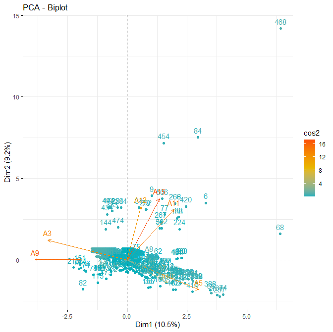
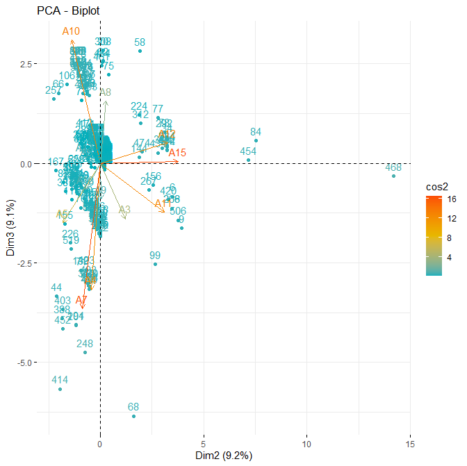
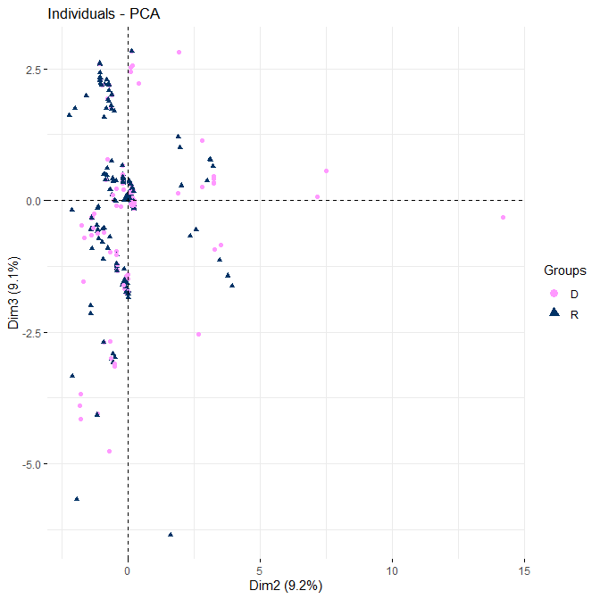

# Step2 - Perform Principal Component Analysis (PCA) and evaluate clustering potential
## Performing a Principal Component Analysis (PCA)

### Removing Categories (columns) with too little population

In order to perform PCA we remove the low weight Categories: A1(column 2),A2(column 3),A14(column 15)
as well the company ID in column 1 and the last columns (Status, RetDis and OldNew)
This is done in the column selector parameter of the prcomp() function, here: c(4:14,15:17)

### Calling the R PCA prcomp() function

PCA prcomp() function parameters: 
- c(4:14,15:17) -> column selection : 
- "center" each column around its average
- normalise each column "scale" by dividing by the column variance (Variance in normalized to 1)
 see: Principal Component Analysis in R: prcomp vs princomp (http://www.sthda.com/english/articles/31-principal-component-methods-in-r-practical-guide/118-principal-component-analysis-in-r-prcomp-vs-princomp/)

> <em>occ.pca <- prcomp(OCC_wStatus[,c(4:14,15:17)], center = TRUE, scale = TRUE)</em>				

## Displaying the bulk PCA results with contributions

### BiPlot companies-variables 1-2 components
> <em>fviz_pca_biplot(occ.pca, axes = c(1, 2),  
             col.ind = "cos2", # Color by the quality of representation 
            col.var = "contrib", # Color by contributions to the PC 
             gradient.cols = c("#00AFBB", "#E7B800", "#FC4E07"), 
                ) 
</em>
                

### BiPlot companies-variables 2-3 components
> <em>fviz_pca_biplot(occ.pca, axes = c(2, 3), repel = TRUE, 
             col.ind = "cos2", # Color by the quality of representation 
            col.var = "contrib", # Color by contributions to the PC 
             gradient.cols = c("#00AFBB", "#E7B800", "#FC4E07"), 
                ) 
 </em>
                

## Displaying PCA results with contributions for Dismissed-Retained classes

<strong>Modify point colors with ggplot2</strong> using the "palette" parameter 	
in: ggplot2 - Essentials (http://www.sthda.com/english/wiki/ggplot2-essentials)

### BiPlot companies-variables 2-3 components with DisvAccept groups (D = Dismissed, R = Retained)
> <em>fviz_pca_ind(occ.pca,
             label = "none", # hide individual labels 
 	     axes = c(2,3), 
             habillage = OCC_wStatus$RetDis, # color by groups 
             palette = c("#FF99FF", "#003366") 
)</em>

## Displaying PCA results with contributions for Old_New classes

<strong>Modify point shapes with ggplot2</strong> using the "scale_shape_manual" parameter  	
in: ggplot2 point shapes (http://www.sthda.com/english/wiki/ggplot2-point-shapes)

### BiPlot companies-variables 2-3 components with OldNew groups (O = Old (24-Mar-2021), N = New (25-May-2021) )
> <em>fviz_pca_ind(occ.pca,
             label = "none", # hide individual labels 
 	     axes = c(2,3), 
             habillage = OCC_wStatus$OldNew, # color by groups 
             palette = c("#FF3366", "#003366") 
) + scale_shape_manual(values=c(19,20)) 
</em>

