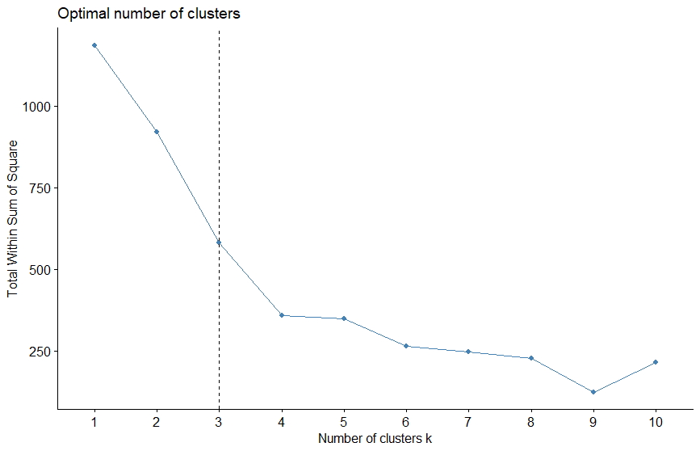

# Step3 - Perform K-means on a factor scores sub-space at evaluate performance

We follow: K-Means Clustering in R: Algorithm and Practical Examples (https://www.datanovia.com/en/lessons/k-means-clustering-in-r-algorith-and-practical-examples/)

## Estimating the optimal number of clusters in a PCA sub-space 2-3

### Constructing the data table to be analysed from PCA factor scores 2-3

We need to extract the 2 factor sores vectors for components 2-3
following:  get_pca: Extract the results for individuals/variables in Principal Component Analysis - R software and data mining (http://www.sthda.com/english/wiki/get-pca-extract-the-results-for-individuals-variables-in-principal-component-analysis-r-software-and-data-mining)

### Extract factor scores
> <em>occ.pca.ind <- get_pca_ind(occ.pca)</em> 
> <em>occ.pca.ind <- occ.pca.ind$coord 
</em>

### Perform k-means on the sub-space 2-3
> <em>bh_occ.pca.23 <- bh_occ.pca.ind[,c(2,3)]</em>

### Prepare k-means result data for display
> <em>df <- scale(bh_occ.pca.23)</em>

### Evaluating the "clustering" capacity of k-means
We follow: fviz_nbclust: Dertermining and Visualizing the Optimal Number of Clusters (https://www.rdocumentation.org/packages/factoextra/versions/1.0.7/topics/fviz_nbclust) 
The best pratice is to <strong>compute a "clustering quality index"</strong> which is the sum of the inertia of clusters as a function of the number of clusters 
A cluster "inertia" is its variance around its center (i.d., average cluster vector). 
Starting from the variance of the whole cloud (one cluster), the sum of the inertia of clusters tends to decrease and stabilize as the number of clusters increases.
The <strong>"elbow rule"</strong> advises to retain the number of clusters where the curve has reached its stable level.

> <em>fviz_nbclust(df, kmeans, method = "wss") + 
geom_vline(xintercept = 3, linetype = 2) 
</em>

<strong>-> INTERPRETATION -></strong> The generated plot shows a significant bend at <strong>4-5 clusters</strong> 
<strong>-> The analysis continues using 5 clusters</strong>
