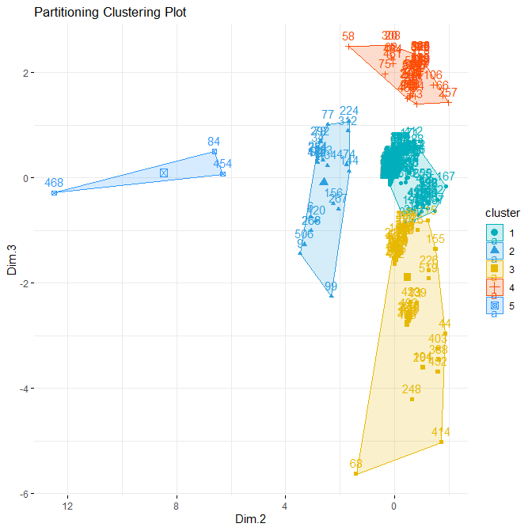
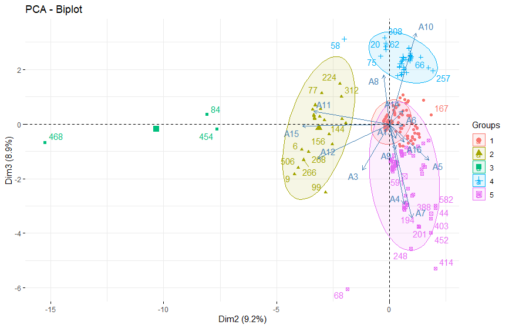

# Step4 - Display clusters statistics of retained clusters

## Determine the k=5 clusters PCA factor space 2-3

Note: We are reusing the df table which was built before from the extracted PCA 2-3 factor scoresfactor
### Pre-determine the pseudo-random series used to determine the initial k-means centers
Note: This determination is done so that clusters will be stable between R runs
> <em>set.seed(123)</em>
### Compute k-means with k = 5
> <em>km.res <- kmeans(df, 5, nstart = 25)</em>

## Display results as "coverage" polygons

### Plotting the cluster results in axes 1,2 plane (Here, the entire data space as its dimensions are 2)
NOTE: 
 - Here we have "axes = c(1,2)" because by construction we have only 2 components (i.d., factor scores)
 - The "palette" parameters for 9 potential clusters are preset following : Colors in R (http://www.sthda.com/english/wiki/colors-in-r)
> <em>fviz_cluster(km.res, data = df, 
             palette = c("#00AFBB","#2E9FDF", "#E7B800", "#FC4E07", "#3399FF", "#FF3399", "#336600", "#330033", "#009966"), 
	     axes = c(1,2), repel = TRUE, 
             ggtheme = theme_minimal(), 
             main = "Partitioning Clustering Plot" 
             )   + scale_x_reverse() 
</em>

<strong>INTERPRETATION -> The separability of the 5 determined groups is rather good</strong>

## Display cluster results in the original original factor space 2-3 biplot

<strong>PROBLEM TO BE SOLVED :</strong> The k-means has labeled the members as belonging to one of 5 different groups (or classes).
However, their coordinates have been modified. We need to place each of these labeled members into their original data space 
<strong>Here, we seek to place the points back into the original 2-3 PCA factor space.</strong> 
This placement will enable to <strong>interpret the relations between each cluster and the "tag" variables</strong> determined by Open Calais 
Here we follow the R practice of Alboukadel Kassambara who is one of the main contributors to the factoextra R package (http://www.alboukadel.com/)	

### Extracting the group (class) vector table for labelling of display
> <em>grp <- as.factor(km.res$cluster)</em> 

### Displaying groups in 2-3 PCA factor space with scatter ellipses
> <em>fviz_pca_biplot(bh_occ.pca, axes = c(2, 3),  
		habillage = grp, 
             	addEllipses = TRUE)   
</em>

<strong>INTERPRETATION -> The separability of the 5 determined groups is again well characterized</strong> 
<strong>NOTE : </strong>for the interpretation of each "tag" variable (A1 to A16), see : (https://github.com/MoiraCorp/Innovkg-exercise-km/blob/main/step1/preprocess/README.md)
