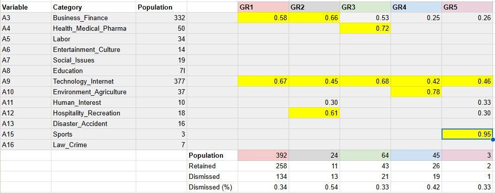

# Step5 - Evaluate fairness of the selection process of the startup dossiers

### Saving the group (class) vector table for future use

> <em>write.csv(grp,"grp.csv", sep=",")</em> 

NOTE -> The group vector grp is exported and then modified for transfer of a few odd companies into of a group 6 for outliers

> <em>grp_modified <- read.table("grp_modified.csv", header=TRUE, sep=",")</em>

### Comparing the Retained and Dismissed groups of companies for testing the "fairness" of the selection process

This experiment is meant to test the usability of the company classification based on their PermID "Intelligent Tagging" scores. It is using the section of the sections of the questionnaire named: "Status". It is aiming at providing an answer to the question: 
	**"Does it exist a bias in the way Basinghall Partners retains or dismisses a particular startup after it has submitted its statement of interest?"** 
This is what we have called "fairness analysis". In other words, based on the classification presented above, is it possible to demonstrate that the selection of dossiers processed is an unbiased (i.d., fair) process?

#### Determining the amount of similiraties between the Retained and Dismissed groups through their PermID characterisation

In order to test this hypothesis, we have separated the population of startups in two sub-groups:
<ul>
<li> Dismissed: for Status, 21. Discontinued or 22. Dismissed</li>
<li> Retained: for all the other values of Status</li>
</ul>

We compare each of these classes through the statistical properties of their corresponding K-means sub-groups. This is done in the factor space (2,3)

> <em>\# Composite plot of ellipses with status</em> 
> <em>grp <- as.factor(grp_modified$GrwithStat)</em> 
> <em>\# Here we want to have the ellipses of Status=Dismissed in grey</em> 
> <em>\# See deriving color palette for 9 classes : http://www.sthda.com/english/wiki/colors-in-r</em> 
> <em>fviz_pca_biplot(occ.pca, axes = c(2, 3),</em>  
> <em>		habillage = grp,</em> 
> <em>		palette = c("#FF0099", "#993FFF", "#0066CC", "#33CCCC", "#009966", "#AAAAAA","#AAAAAA", "#AAAAAA", "#AAAAAA", "#AAAAAA", "#AAAAAA", "#AAAAAA"),</em> 
> <em>             	addEllipses = TRUE)</em> 

This diagram shows that for 5 groups, the “dispersion ellipses” of the Dismissed sub-groups (showed in grey) overlap almost perfectly with the “dispersion ellipses” of that of original population of companies. 
**From these results it is concluded that the Basing Hall Partners process is reasonably “fair”**

It is also common to represent each groups by their average vector of category scores.

> <em>\# Statitics for each group of companies</em> 
> <em>grp_stat <- describeBy(OCC_wStatus[,c(4:14,15:17)],grp_modified$Group, mat=TRUE)</em> 

> <em>\# Statitics for each group of companies broke down by Dismissed-Retained categories</em> 
> <em>gpr_statDR <- describeBy(OCC_wStatus[,c(4:14,15:17)],grp_modified$GrwithStat, mat=TRUE)</em> 

In the above table the highest values category scores are presented in yellow. It shows that all the companies' activities involve Internet with added specificities:  
<ul>
<li> GR1: “Business-Finance”</li>
<li> GR2: “Hospitality-Recreation with financing”</li>
<li> GR3: “Helth_Pharmacy”</li>
<li> GR4: “Environment Agriculture”</li>
<li> GR5: “Sports”</li>
</ul>

